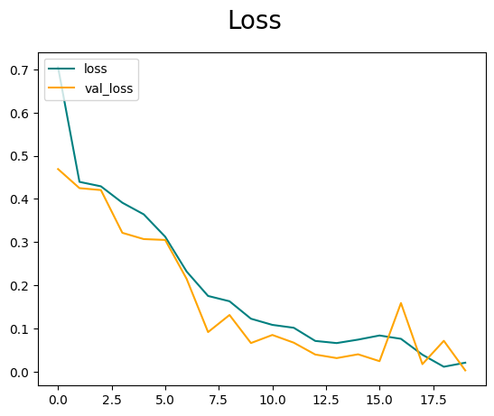
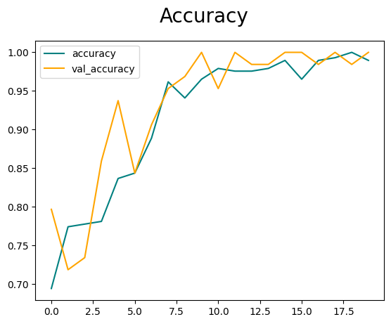
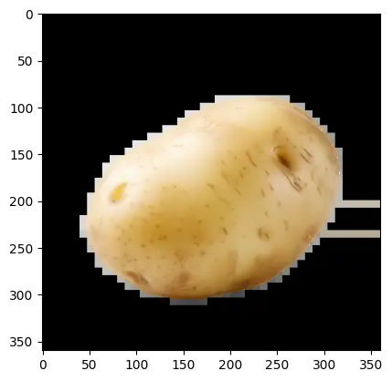

# Potato Quality Classification

A TensorFlow/Keras image classification project for distinguishing fresh and rotten potatoes using a convolutional neural network.

The project covers image preprocessing, model training, evaluation, individual image predictions, and saving and loading a trained model.

## Dataset

The project uses the potato categories fresh and Rotten.

The current local dataset contains 392 images across two classes:

- Fresh potatoes
- Rotten potatoes

The full dataset is excluded from this repository.

## Method

Images are resized to 256 × 256 pixels and normalized to the range [0, 1].

The CNN consists of:

- Three convolutional layers with 16, 32, and 16 filters
- Max-pooling after each convolutional layer
- A flattening layer
- A dense layer with 256 units and ReLU activation
- A single sigmoid output for binary classification

The model is trained for 20 epochs using the Adam optimizer and binary cross-entropy loss.

## Training Curves

Training and validation accuracy and loss are plotted to examine the model's learning behavior.






## Example Prediction

The notebook demonstrates loading a potato image, preparing it for the model, and displaying the predicted class.



## Evaluation and Limitations

The notebook calculates precision, recall, and binary accuracy.

The current implementation is a tutorial-based baseline. The dataset is split using `take()` and `skip()` on a shuffled source, so independence between the training, validation, and test subsets has not been established. Current metrics should therefore be treated as exploratory.

Consistent RGB preprocessing for individual image predictions also remains a planned correction.

Performance on new images under different lighting, backgrounds, and camera conditions has not yet been established. The model predicts visual appearance and cannot determine food safety.

## Technologies

- Python
- TensorFlow / Keras
- NumPy
- OpenCV
- Pillow
- Matplotlib
- JupyterLab

## Run Locally

1. Clone the repository:

   ```bash
   git clone https://github.com/MaryamRani08/potato_quality_classification.git
   cd potato_quality_classification
   ```

2. Create a virtual environment:

   ```bash
   python -m venv .venv
   ```

3. Activate it on Windows:

   ```bat
   .venv\Scripts\activate
   ```

   On Linux or macOS:

   ```bash
   source .venv/bin/activate
   ```

4. Install dependencies:

   ```bash
   python -m pip install -r requirements.txt
   ```

5. Download the dataset and place the potato images in these folders:

   ```text
   data/fresh/
   data/rotten/
   ```

6. Open `Potato Image Classification .ipynb` in JupyterLab, select the appropriate Python kernel, and run the cells in order.

The dataset, Python environment, training logs, and saved model files are excluded from version control. Running the training cells generates the model locally.

## Planned Improvements

- Create fixed, separate training, validation, and test subsets.
- Check for duplicate images across subsets.
- Use consistent RGB preprocessing for individual predictions.
- Repeat evaluation and add a confusion matrix.
- Test additional images with different backgrounds and lighting.

